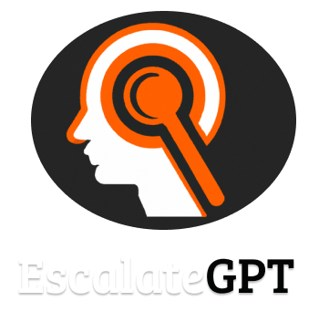

<p align="center">
    
</p>

## Introduction

 IAM Privilege Escalation Identification Tool

## Features

- 🛠️ Identifies potential privilege escalation issues in AWS IAM and Azure RBAC policies
- 💻 Leverages most advanced AI models via OpenAI for analysis
- 👍 Returns escalation paths and mitigation recommendations in easy to understand JSON format
- 🔑 Designed to integrate with and enhance Tenable Cloud Security cloud configuration auditing

## Summary
EscalateGPT is a Python tool designed to identify privilege escalation opportunities in Amazon Web Services (AWS) and Azure Identity and Access Management (IAM) policies. 
It can help security teams find misconfigurations in IAM permissions that could allow unauthorized access or privilege escalation.
The tool retrieves all IAM policies associated with users or groups in an AWS account or AzureAD, and passes them to the OpenAI API to analyze. OpenAI will attempt to identify any potential ways those policies could be exploited to gain elevated permissions, as well as recommend mitigation strategies.

In testing, EscalateGPT leveraging GPT-4 managed to identify complex privilege escalation scenarios based on non-trivial IAM.
## Requirements

1. Python 3.7
2. OpenAI API Key

## Installation

```sh
git clone https://github.com/tenable/EscalateGPT.git
cd EscalateGPT
pip install -r requirements.txt
```
## Usage

```sh
AWS
python openapi_script.py YOUR_OPENAPI_KEY --platform AWS --aws-key YOUR_AWS_KEY --aws-secret YOUR_AWS_SECRET

Azure
python openapi_script.py YOUR_OPENAPI_KEY --platform AZURE --username YOUR_AZURE_USERNAME --password YOUR_AZURE_PASSWORD --tenant-id YOUR_AZURE_TENANT_ID

```

## Contributing
EscalateGPT is an open source tool. Contributions to improve capability to find additional privilege escalation vectors are welcome!

## Disclaimer

This tool is provided for educational and research purposes only. The authors assume no liability and are not responsible for any misuse or damage caused by this tool.

## License

This project is licensed under the GPL License. See the LICENSE file for more details._