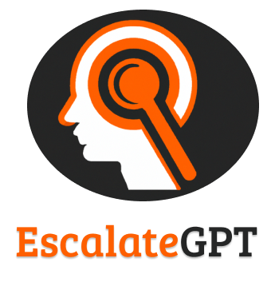

# EscalateGPT
<p align="center">
    
</p>

## Introduction

A powerful Python tool that leverages the power of OpenAI to analyze AWS IAM misconfigurations.

## Features

- 🛠️ EscalateGPT is a Python tool to identify IAM policy issues and enhance Tenable Cloud Security
- 💻 EscalateGPT retrieves IAM policies, prompts OpenAI API, and returns results in JSON format
- 👍 GPT4 identified more privilege escalation scenarios than GPT3.5-turbo in real-world AWS environments
- 🔑 Results include path, ARN, and mitigation strategies for identified vulnerabilities

## Summary

When it comes to cloud security, misconfigurations in Identity and Access Management (IAM) tools are one of the most common concerns for organizations and are far too often overlooked. In fact, in Tenable's 2022 Threat Landscape Report, our research team found that over 800 million exposed records were attributed to cloud misconfigurations. Because IAM policy misconfigurations are so common, we set out to develop a tool to help identify IAM policy issues that could be incorporated and further enhance Tenable Cloud Security (formerly Tenable.cs) cloud security. Enter EscalateGPT, a Python tool designed to identify privilege escalation opportunities in Amazon Web Services (AWS) AWS IAM.
This tool can be used to retrieve all IAM policies associated with users or groups and will then prompt the OpenAI API, asking it to identify potential escalation opportunities and any relevant mitigations. EscalateGPT returns results in a JSON format that includes the path, the Amazon Resource Name (ARN) of the policy that could be exploited for privilege escalation and the recommended mitigation strategies to address the identified vulnerabilities. In our testing against real-world AWS environments, we found that GPT4 managed to identify complex scenarios of privilege escalation based on non-trivial policies through multi-IAM accounts. As a comparison, using GPT3.5-turbo, we found that only half of the privilege escalation cases we tested for were identified.

## Requirements

1. Python 3.7
2. OpenAI API Key

## Installation

```sh
git clone https://github.com/tenable/EscalateGPT.git
cd EscalateGPT
pip install -r requirements.txt
```
## Usage

```sh
python escalate_gpt.py -openai_key [OPENAI_API_KEY] -aws_key [AWS_ACCESS_KEY] -aws_secret [AWS_SECRET_ACCESS_KEY]
```
openai_key is required
aws_key and aws_secret are optional. 
If not provided, the script will use the default AWS credentials provided in the environment.

## Disclaimer

This tool is provided for educational and research purposes only. The authors assume no liability and are not responsible for any misuse or damage caused by this tool.

## License

This project is licensed under the GPL License. See the LICENSE file for more details.